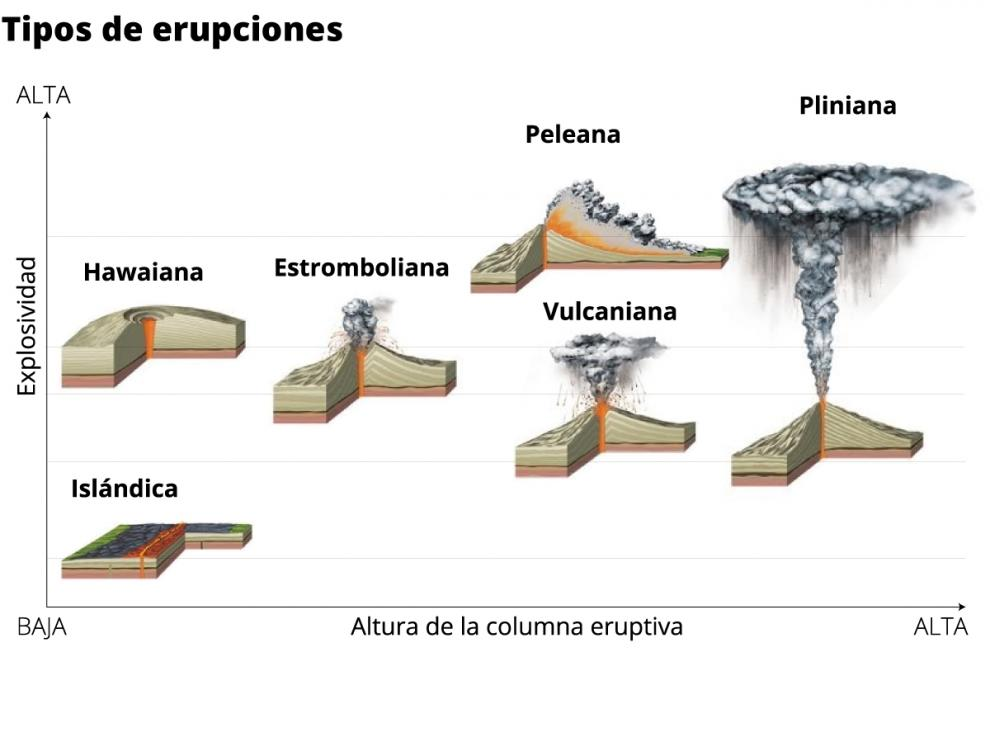
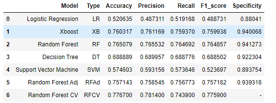

# Challenge_TalentSquad
Volcano eruption classification 🌋

## To take in account

In the repository there are two empty files: predictions.json and app.py. These files were created because otherwise I couldn't upload the solution to the challenge in the Nuwe platform. The correct files are eruption_predictions.csv and the jupyter notebook file.

IMPORTANT:

**PLEASE OPEN THE NOTEBOOK WITH NBVIEWER**: https://nbviewer.org/github/Cristina-Porta-Serrano/Challenge_TalentSquad/blob/main/Volcanic%20eruptions%20classification.ipynb
 
 **THERE ARE DINAMYC VISUALIZATIONS THAT CANNOT BE DISPLAYED ON THE JUPYTER NOTEBOOK UPLOADED ON GITHUB.**

## State of art

Jorge is a geologist at SGMI (Spanish Geological and Mining Institute) who is developing a new eruption prevention system to be able to predict what type of eruption a volcano will have based on the vibrations detected by its sensors during the days prior to the eruption. This will reduce the risk of victims and material damage caused by this kind of natural disaster.

Jorge's system works with 5 types of eruptions:

- Plinian: It is characterized by its high degree of explosiveness, with very violent manifestations in which large volumes of volcanic gas, fragments and ashes are expelled.

- Peleana: The most important characteristic of a peleana eruption is the presence of a bright avalanche of hot volcanic ash, called a pyroclastic flow.

- Vulcanian: They are explosive-type volcanic eruptions. The magmatic material released is more viscous than in the case of Hawaiian or Strombolian eruptions; consequently, more pressure builds up from the magma chamber as magma rises toward the surface.

- Hawaiian: Consists of the emission of volcanic material, mostly basaltic, in an effusive or non-explosive manner. It happens this way because the diffusion of gases through more basic magmas (basaltic) can be slow but more or less continuous. Consequently, volcanic eruptions of this type are usually not very destructive.

- Strombolian: The Strombolian eruption is characterized by explosive eruptions separated by periods of calm of variable duration. The process of each explosion corresponds to the evolution of a gas bubble released by the magma itself.

The objective of this challenge will be to help Jorge by performing predictive modeling from a dataset that contains the measurements made by the sensors and their types.

* Features/Attributes: The dataset contains 6 features in 6 columns, which are the parameters measured by the different sensors. These correspond to the vibrations detected at certain points on the slope of the volcano.

* Target variable: The target corresponds to the 'label' that classifies the types of volcanic eruptions based on the features measured by the sensors.

## Results

We have tried different models using various classifiers such as Decision Tree, Logistic Regression Classifier, Support Vector Machine, XGBoost and Random Forest and we have tried to improve it using different feature engineering techniques. The results of the f1_score of the best model, Random Forest, have been validated using Cross Validation. A result of 77'59% has been achieved with the Cross Validation approach using Random Forest without hyperparameter tunning. A table with the results has been created:

## Conclusions

- It is a small dataset with little features and all the features have the same characteristics so it's difficult to "play" with them to achieve different results.

- I have chosen RandomForest for the predictions because of its good results compared to the other models evaluated.

- I have found that RandomForest has been a very stable model and when performing CrossValidation it has given very consistent results, so we believe that it is a robust model.

- On the other hand, it has been difficult to improve the initial results of the model, I tried several different techniques and I achieved small improvements. It seems that the default parameters already worked well with our data.

## Requirements

This notebook requires a Python 3.6 or newer version.

To run this notebook you must have installed the following libraries:

    pip install pandas
    pip install numpy
    pip install matplotlib
    pip install -U scikit-learn
 
 **PLEASE OPEN THE NOTEBOOK WITH NBVIEWER**: https://nbviewer.org/github/Cristina-Porta-Serrano/Challenge_TalentSquad/blob/main/Volcanic%20eruptions%20classification.ipynb
 
 **THERE ARE DINAMYC VISUALIZATIONS THAT CANNOT BE DISPLAYED ON THE JUPYTER NOTEBOOK UPLOADED ON GITHUB.**
